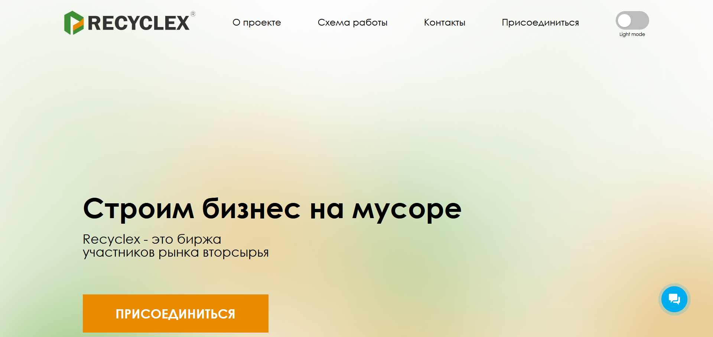
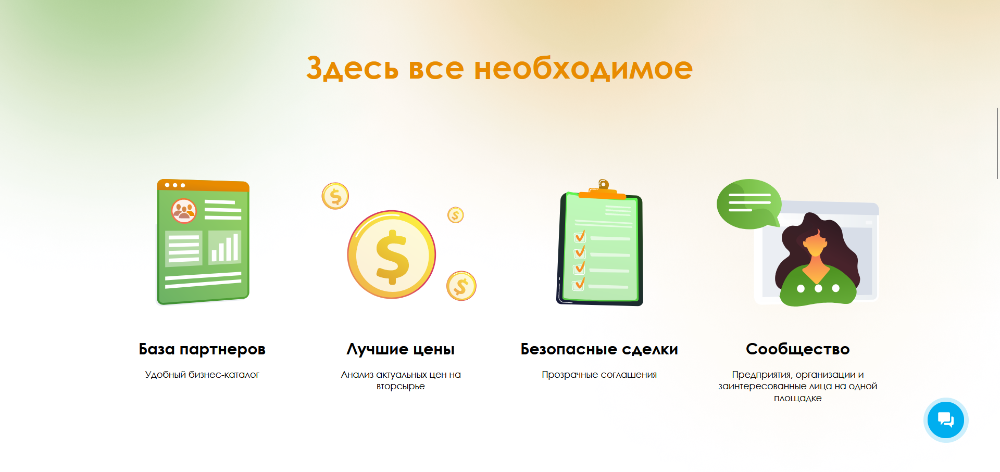

# recyclex

Website of the company Recyclex, which specializes in recycling various types of waste. In addition to basic information about the company, the site offers the opportunity to get acquainted with the work scheme, fill out a form and send an application for cooperation, and choose a light/dark theme for displaying content. The site also has tablet and mobile versions.

## Result

https://maria2721.github.io/recyclex/

## Technologies

&nbsp;
&nbsp;

## Getting started

In the project directory, you can run:

`npm install`

`npm run start`

## Thanks to all Contributors

